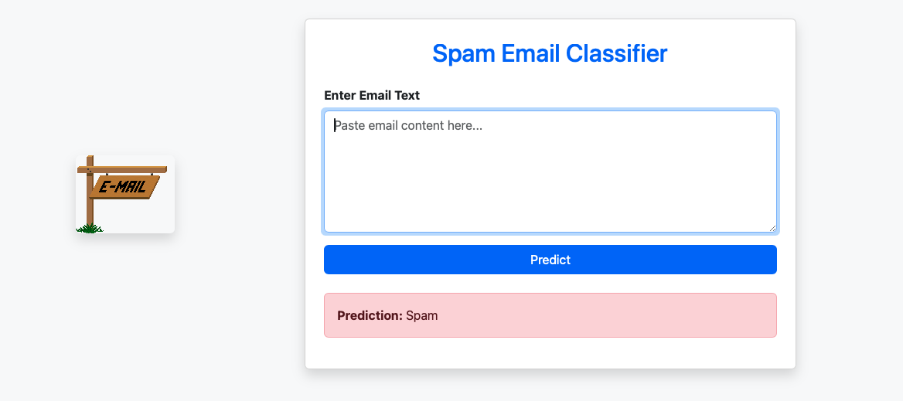

# 📧 Spam Email Classifier

### Objective: Help users quickly detect if an email is spam or not using a neural network model and a clean, intuitive web interface.

This is a Flask-based machine learning web app that allows users to input the content of an email and instantly receive a prediction of whether it’s **Spam** or **Not Spam**. The model was trained using TF-IDF features and a PyTorch-based neural network, and is deployed in a simple Flask web app with a responsive HTML interface.

---

## 🚀 Features

- 🔍 Classifies emails into **Spam** or **Not Spam** categories using a neural network
- 🧠 Uses TF-IDF vectorization for text preprocessing
- ⚙️ Deployed with Flask, styled using HTML + inline CSS
- 🤖 Leverages a PyTorch model and pre-trained `.pth` + `joblib` vectorizer
- 🖥️ Responsive form-based interface for fast real-time predictions

---

## 🧰 Tech Stack

| Layer        | Tech                          |
|--------------|-------------------------------|
| Frontend     | HTML, Inline CSS              |
| Backend      | Python, Flask                 |
| Model        | PyTorch, NumPy, Joblib, Scikit-learn |
| Dev Tools    | VS Code, Git, GitHub          |

---

## 🧪 Demo



---

## 📝 Example Inputs

```text
Email Input:
"Congratulations! You've won a free iPhone. Click here to claim your prize now."

→ Predicted Output: Spam

---

Email Input:
"Hey John, attached is the report you asked for. Let me know if you need any changes."

→ Predicted Output: Not Spam
